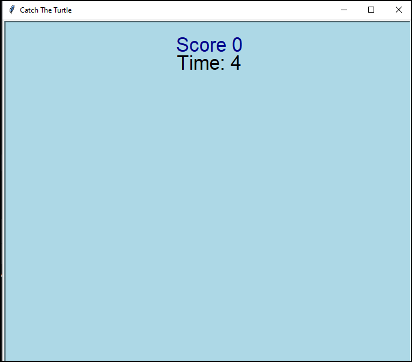
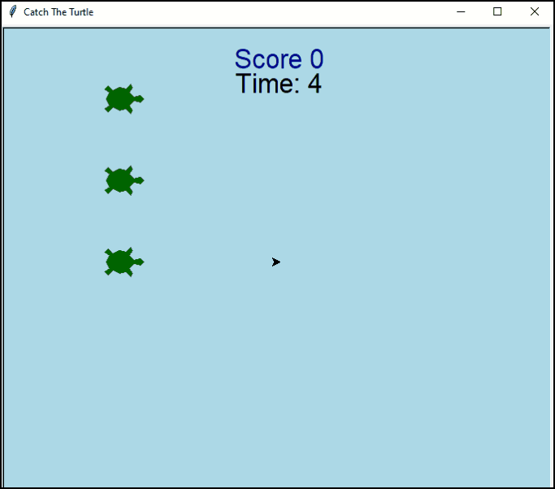
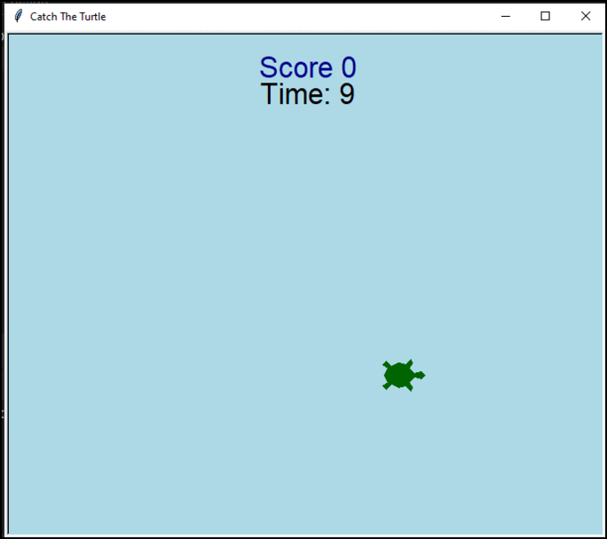

## Catch The Turtle - 🐢

This is a simple and fun Python game. Your goal is to click on as many turtles as possible before time runs out. The turtles appear randomly on the screen.

#### About the Game
This project was developed using basic Python programming skills, such as if, for, and while loops, and functions. It also uses the features of the turtle library. At the end of the game, it shows your final score and the time that has passed.

#### How to Play
When the game starts, a turtle will pop up at a random position on the screen. Click on it as fast as you can. Each click gives you one point. When your time is up, the game ends, and you can see your total score.

#### How I Coded My 'Catch the Turtle!' Game
##### 1. The Foundation: Setup and Variables

Every project needs a solid start. I began by setting up the screen and defining the main variables.

- `screen = turtle.Screen()`: This line created the main window where our game is played.

- `score = 0`: This simple variable keeps track of the player's score.

- `game_over = False`: This is a "flag" or a status variable. It tells my program whether the game is running or if it's over. This is very important for controlling the game's flow.

- I also created separate turtle objects to handle specific jobs, like one for writing the score and another for the countdown timer.
 
##### 2. Creating and Controlling the Turtles

This is the core of the game's mechanics. I needed to create many turtles and make them clickable.

- `setup_turtles()`: Instead of manually creating each turtle, I used a nested `for` loop. This powerful technique allowed me to efficiently create a grid of turtles by iterating through predefined `x` and `y` coordinates.

- `make_turtle(x, y)`: This function is the "factory" for a single turtle. It sets its shape and color. Most importantly, it uses the `.onclick()` method to listen for a click event on that specific turtle.

- `handle_click(x, y)`: This is a callback function. It doesn't run on its own; it waits to be called by the `.onclick()` method whenever a player clicks a turtle. Inside this function, I use `global score` to change the main score variable and update the score on the screen.
  

##### 3. Making the Game Dynamic: The Timer and Animation

A simple setup is not a complete game. I needed to add a timer and make the turtles move randomly to create a challenge.

- `show_turtles_randomly()`: This function is the heart of the game's animation. It first checks if the `game_over` flag is `False`. If it is, it hides all turtles, then picks a random one from my `turtle_list` to show. The magic happens with `screen.ontimer()`, which schedules the function to run again after half a second, creating an infinite loop.

- `countdown(time)`: This function manages the game's time limit. I used `screen.ontimer()` here as well. It schedules a future call to itself, but with the `time` variable reduced by one. When the time reaches zero, it sets the `game_over` variable to `True`, which stops the `show_turtles_randomly()` loop and ends the game.
##### 4. The Final Touch: Game Flow

All of these separate components needed a main orchestrator to start the game properly.

- `start_game_up()`: This single function runs all the necessary setup functions in the correct order. I used `turtle.tracer(0)` at the beginning and `turtle.tracer(1)` at the end to hide the drawing process, making the game screen appear instantly and smoothly for the user.
  
   

By breaking the project into smaller, manageable parts, I was able to build a fun and fully functional game. I hope this explanation helps you with your own coding projects!
